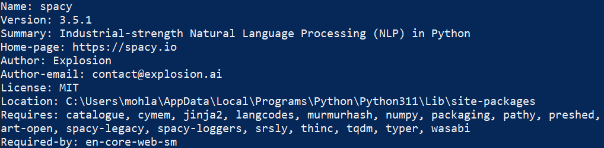

# Watch-Next
The program returns the title of the next movie whose description similarity to sample description is the highest.  
  
# Tools
<a href="https://www.python.org/downloads/" target="_blank"><span style="color:orange;">Python</span></a> - Download and install   
<span style="color:orange;">SpaCy</span> - To install using pip  
<span style="color:orange;">Language Model <b>[ <span style="color:green;">English</span> ]<b></span> - To download using spacy    

# Installations  
### Environment setup 
- Download the latest, correct <a href="https://www.python.org/downloads/" target="_blank"><span style="color:orange;">Python</span></a> version for your operating system and install it.
- Once python is installed, open command line and enter the command below:  
```
python -m pip install spacy  
```  
- To confirm successful installation of spacy, enter the following command:
```
pip show spacy
```  
- Results should be similar to the following  
  

- Download English Model, 'en_core_web_md', enter the following command:
```   
python -m spacy download en_core_web_md  
```  
- open cmd and change to the directory where 'watch_next.py' is.  

- Now we can run the program using the following command  
```  
python watch_next.py  
```  

# watch_next - Dockerizing
This part of the guide is suitable for dockerizing the program  
- Download and install <a href="https://www.docker.com/products/docker-desktop/" target="_blank">Docker</a> desktop, and choose the correct version for your OS.
- <a href="https://hub.docker.com/signup">Register</a> a new docker account, or login if already registered.
- Open cmd and run following commands
    - Pull the image to local folder
    ```
    docker pull mohapi007/watch_next:lastest  
    ```
    - Create a container  
    ```  
    docker run -it mohapi007/watch_next  
    ```
    - To start the app  
    ```  
    python watch_next.py  
    ```  

  
# Enjoy

